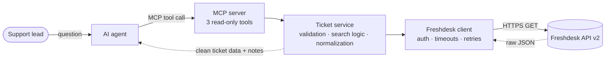
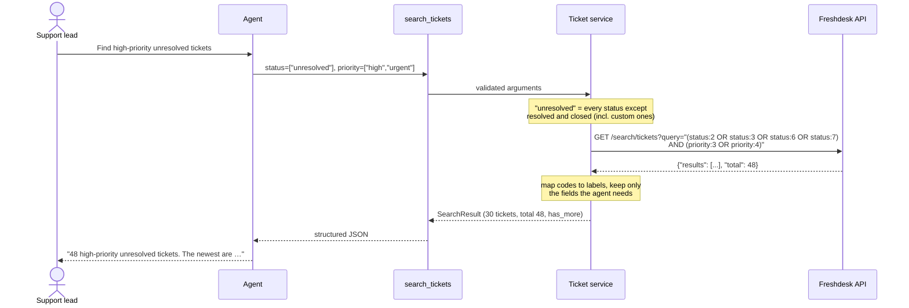

# Freshdesk ticket connector for AI agents

An MCP server that lets an AI agent **read** a merchant's Freshdesk support tickets: list them, look one up, and search by status, priority, tag, type, date or keyword. It can't change anything in Freshdesk, and the agent never sees the API key.

Built as a take-home for Razorpay's Forward-Deployed Engineer (Agent Studio) role, assignment 3: *a private connector that lets an Agent Studio agent read tickets from a merchant tool.*

## Why

A support lead wants to ask an agent things like *"which unresolved tickets are oldest?"* or *"anything about payment failures?"* instead of clicking through Freshdesk.

Giving the agent the raw Freshdesk API doesn't work well. Statuses are numbers, there is no text search, search can't sort and stops at 300 results, the list endpoint quietly covers only the last 30 days, and an API key with write access would be one prompt away from closing tickets.

This connector sits in between. It gives the agent three narrow, read-only tools whose results are easy to reason about. When an answer is incomplete, the result says so and says what to try next.

## How it works



Each layer has one job. The MCP layer knows nothing about HTTP, and the HTTP client knows nothing about MCP. The API key is only used inside the client. Details are in [docs/architecture.md](docs/architecture.md).

One request, end to end:



## Tools

| Tool | Use it for | Key inputs |
|---|---|---|
| `list_tickets` | Recent tickets, no filters | `order_by` (created/updated), `order`, `page`, `page_size` ≤ 50, `updated_since` |
| `get_ticket` | One ticket in full | `ticket_id` |
| `search_tickets` | Filtering and finding | `status` (incl. `unresolved`), `priority`, `tag`, `ticket_type`, `created_after`/`created_before`, `keyword`, `order`, `page` |

All three are marked `readOnlyHint: true`. The full schemas, generated from the running server, are in [docs/mcp-tools.json](docs/mcp-tools.json). What the agent can and can't do is spelled out in [docs/CAPABILITIES.md](docs/CAPABILITIES.md).

A search result looks like this (trimmed):

```json
{
  "search_mode": "native",
  "tickets": [
    {"id": 1196, "subject": "Order delivered late", "status": "open", "priority": "urgent",
     "created_at": "2026-09-30T08:12:00Z", "url": "https://acme.freshdesk.com/a/tickets/1196", "...": "..."}
  ],
  "page": 1, "has_more": true, "total": 48, "notes": [],
  "keyword": null, "max_scan": null, "scanned": null, "matched": null, "exhaustive": null
}
```

## Example questions

| The user asks | The agent calls |
|---|---|
| Show me the latest unresolved tickets | `search_tickets(status=["unresolved"])` |
| Find high-priority unresolved tickets | `search_tickets(status=["unresolved"], priority=["high","urgent"])` |
| Find tickets about payment failures | `search_tickets(tag="payment")`, or `search_tickets(keyword="payment fail")` if tickets aren't tagged |
| Give me ticket 12345 | `get_ticket(ticket_id=12345)` |
| Which unresolved tickets are the oldest? | `search_tickets(status=["unresolved"], order="oldest_first")` |
| What came in this week? | `list_tickets()` |

## Setup

You need Python 3.11+ and [uv](https://docs.astral.sh/uv/).

```bash
git clone <repo-url> && cd freshdesk-connector
uv sync
cp .env.example .env    # then fill in the two required values
```

| Variable | Required | Default | Meaning |
|---|---|---|---|
| `FRESHDESK_DOMAIN` | yes | | `acme` or `acme.freshdesk.com`. Other hosts are rejected. |
| `FRESHDESK_API_KEY` | yes | | Freshdesk *Profile settings → View API key*. Use an agent with a restricted role. |
| `FRESHDESK_TIMEOUT_SECONDS` | no | 10 | Per request |
| `FRESHDESK_MAX_ATTEMPTS` | no | 3 | 1 disables retries |
| `FRESHDESK_MAX_RETRY_WAIT_SECONDS` | no | 10 | A longer `Retry-After` fails fast instead of waiting |

The Freshdesk Free plan has no API access; a trial account works. You don't need any account for the tests or the offline demo.

## Running the server

```bash
uv run freshdesk-connector                    # stdio (default), for local MCP clients
uv run freshdesk-connector --transport http   # Streamable HTTP on http://127.0.0.1:8000/mcp
```

Logs go to stderr (`--log-level DEBUG|INFO|WARNING`), one line per HTTP request and one per tool call. Tool arguments and results aren't logged.

To use it from Claude Desktop or another MCP client, point the client at the command:

```json
{
  "mcpServers": {
    "freshdesk": {
      "command": "uv",
      "args": ["--directory", "/path/to/freshdesk-connector", "run", "freshdesk-connector"]
    }
  }
}
```

The server reads credentials from `.env` in that directory, so they don't need to go in the client's config.

## Demo

```bash
uv run python demo/mcp_cli.py --offline list
uv run python demo/mcp_cli.py --offline call search_tickets '{"status": ["unresolved"], "order": "oldest_first"}'
```

`--offline` runs the real server, service and client against an in-memory fake Freshdesk with 200 invented tickets, so no credentials are needed. Drop `--offline` to use your own account from `.env`. [docs/DEMO.md](docs/DEMO.md) walks through all five questions, the failure cases (missing ticket, bad key, rate limit in the middle of a scan), and what an independent agent did with the tools.

## Tests

```bash
uv run pytest            # 224 tests, about 20 s, no network
uv run pytest --cov=freshdesk_connector
```

The tests mock Freshdesk at the HTTP level (respx), drive the real MCP server through the SDK's in-memory client, run the offline demo, and check that `docs/mcp-tools.json` still matches the server. If you change a tool, regenerate the spec:

```bash
uv run python scripts/export_tool_spec.py
```

## Read-only boundary and secrets

- There are exactly three tools and none of them writes. The HTTP client only has a GET path; there is no generic `request()` that a future tool could misuse. Tests check both.
- The API key is read once into a `SecretStr` and handed to httpx's Basic auth. Error messages are written by the connector from status codes, not copied from responses. A live DEBUG-level run was checked for the key, the encoded credentials and `Authorization`, and none appeared.
- `FRESHDESK_DOMAIN` must be a `*.freshdesk.com` subdomain, and redirects aren't followed, so the key can't be sent elsewhere.
- Requester IP addresses, custom fields, CC addresses and conversations are dropped before anything reaches the agent.
- The weak point is the key itself: Freshdesk can't issue read-only keys. Use one from a Freshdesk agent with a restricted role.

## Limitations

- **No text search in Freshdesk.** Keyword search reads at most 90 tickets per call and is a literal substring match (no stemming). Results say when the scan was incomplete.
- **Oldest-first is exact up to 90 matches.** Beyond that the result is flagged and names the `created_before` date to search next.
- **Freshdesk search stops at 300 results per query and can't sort.** `newest_first` relies on Freshdesk's own order, which looks like newest-created-first but isn't documented.
- **`list_tickets` covers the last 30 days** unless `updated_since` is given.
- **Some things weren't tested live** because the trial account had only 3 sample tickets: multi-page search, tag search and real 429s. They're covered by mocked tests and the offline demo.
- **No proactive throttling.** One slow call can take about 50 s in the worst case (3 attempts × 10 s timeout).
- **The HTTP transport has no authentication.** It binds to localhost by default.
- **Statuses added in Freshdesk while the server runs** show as `status_<code>` until restart.

## What this project deliberately doesn't do

- **Write anything to Freshdesk.** No create, update, reply, close or delete.
- **Read contacts, companies, agents, conversations or attachments.**
- **Multi-tenant credential management, OAuth, caching, a database or a UI.** None of them were needed to answer the questions above, and each would add something to secure and maintain.

## Design decisions

The main ones, with alternatives and trade-offs, are in [docs/architecture.md](docs/architecture.md#decisions-and-trade-offs). In short:

- **Layered client / service / server.** Freshdesk quirks stay out of the tool layer, and each layer is tested alone.
- **Typed search filters** instead of letting the model write Freshdesk query syntax. They're harder to get wrong and can't be used for injection.
- **Read status names from Freshdesk at startup.** A brand-new trial already had three custom statuses, and "unresolved" would otherwise miss them.
- **Bounded scans with an honest `exhaustive` flag,** rather than either fetching everything or pretending a partial answer is complete.
- **A hand-written retry loop** that respects `Retry-After` and fails fast when the wait is too long for an interactive agent.
- **Official MCP Python SDK v2,** and no web framework, since MCP already provides the transport.

## Assignment checklist

| Asked for | Where |
|---|---|
| Connector that lets an agent read tickets | `src/freshdesk_connector/`, verified against a live trial ([DEMO.md](docs/DEMO.md)) |
| Working OAuth or API-key auth | API key via Basic auth: `config.py`, `client.py` |
| List / get / search primitives | `list_tickets`, `get_ticket`, `search_tickets` |
| Rate-limit handling | `client.py` (429, `Retry-After`, bounded retries, fail-fast); partial scan results in `service.py` |
| MCP tool specification | [docs/mcp-tools.json](docs/mcp-tools.json), checked against the server by a test |
| What the agent can and cannot do | [docs/CAPABILITIES.md](docs/CAPABILITIES.md) |
| Setup, run, assumptions, limitations | this README |
| No real data or credentials | `.env` is git-ignored; tests and demo use invented data on `example.com` |

## Repository layout

```
src/freshdesk_connector/   the connector (config, client, service, server, ...)
tests/                     unit, HTTP-mocked, MCP and demo tests; fixtures/ holds fake API bodies
demo/                      MCP command-line client and the in-memory fake Freshdesk
scripts/                   export_tool_spec.py → docs/mcp-tools.json
docs/                      architecture, Freshdesk API notes, capabilities, demo, tool spec
```
