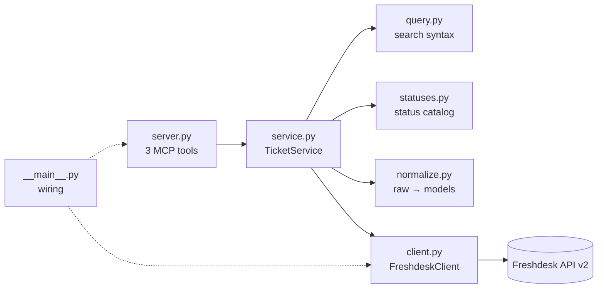

# Architecture

How the connector is put together and why. For Freshdesk API behaviour see [freshdesk-api-notes.md](freshdesk-api-notes.md); for the exact tool schemas see [mcp-tools.json](mcp-tools.json).

## Layers

| Module | Responsibility | Knows about |
|---|---|---|
| `server.py` | Tool names, descriptions and argument schemas. Calls one service method per tool. Turns `ConnectorError` into an MCP tool error. | MCP, the service |
| `service.py` | Validation, pagination limits, the three search paths, scan limits, `notes` for the agent | Freshdesk *semantics* (status codes, 30-per-page search) but not HTTP |
| `query.py` | Builds the Freshdesk search string from typed filters | Freshdesk query syntax |
| `statuses.py` | Status code ↔ label, including custom statuses, and what "unresolved" means | — |
| `normalize.py` | Raw ticket JSON → `TicketSummary` / `TicketDetail` | Freshdesk field names |
| `models.py` | The output contract the agent sees | — |
| `client.py` | Auth, timeouts, retries, HTTP status → typed error. GET only. | httpx, Freshdesk URLs |
| `config.py` | Settings from the environment; validates the domain | — |
| `__main__.py` | Builds the real HTTP client, Freshdesk client and service, then starts the server | everything, but only to wire it together |

The rule is that `server.py` never imports httpx and `client.py` never imports MCP. This keeps each layer testable on its own: the service is tested with a fake client, and the tools with a fake service.

## Search: three paths

Freshdesk search filters on fields but can't sort and can't search text. The service picks one of three paths:

| Path | When | Freshdesk calls | Result |
|---|---|---|---|
| Native page | no keyword, `newest_first` | 1 | Freshdesk's page `n` (30 per page, pages 1–10), sorted newest first within the page |
| Oldest-first scan | no keyword, `oldest_first` | up to 3 | reads up to 90 matches, sorts them by `created_at` here, pages 1–3 |
| Keyword scan | `keyword` given | up to 3 | reads up to 90 candidates matching the other filters, keeps those whose subject + description contain every word, pages 1–3 |

Both scans fill `max_scan`, `scanned` and `exhaustive` in the result. When `exhaustive` is false, a note says why and gives the next step. For example: "The scanned tickets were created on or after 2026-04-29; to find older ones, search again with `created_before="2026-04-29"`." The true oldest matches are always on or before the earliest scanned day, so following that note works whatever order Freshdesk returns results in.

A scan stops early and returns what it has, flagged `exhaustive: false` with the reason, if:

- page 2 or 3 hits a temporary error (rate limit, 5xx, timeout, network). A failure on page 1 is returned as an error, because there's nothing useful to show yet;
- 15 seconds have passed before the next page would start;
- Freshdesk returns fewer tickets than its own `total`, meaning results changed while we paged through them.

Tickets are de-duplicated by ID across pages.

## Statuses

`GET /ticket_fields` is read once at startup to learn the account's status names. Labels are slugs of the agent-facing names (`waiting_on_customer`). `unresolved` means every status except Resolved (4) and Closed (5), so custom statuses count.

If the call fails, the service starts with the four built-in statuses, retries on a later tool call at most once a minute, and adds a note to results until it succeeds. A status added in Freshdesk after a successful load needs a restart.

## Reliability

| Setting | Value | Why |
|---|---|---|
| Timeout per request | 10 s | Don't hang an agent's tool call |
| Attempts | 3 | Enough for a blip; more just delays the answer |
| Retried | 429, 500, 502, 503, 504, timeouts, network errors | Temporary by nature. All calls are GETs, so repeating them is safe |
| Not retried | other 4xx, bad JSON, undecodable body | Won't fix itself, and Freshdesk counts failed calls against the rate limit |
| 429 wait | `Retry-After`, or backoff 0.5 s → 1 s (±25%) | If `Retry-After` > 10 s, fail fast with "try again in about N seconds" rather than block |
| Scan time budget | 15 s | Keep a multi-page scan well under typical client timeouts |

Worst case for a single non-scan call is about 50 s (3 × 10 s plus waits). There's no proactive throttling. The connector reacts to 429s and logs a warning when less than 10% of the minute's quota is left.

## What the agent sees

- Ticket summaries: id, subject, status label, priority label, type, tags, timestamps, requester/agent/group IDs, and a link to the ticket in Freshdesk.
- `get_ticket` adds the plain-text description (cut at 2,000 characters), the channel, requester id/name/email, and first-response/resolved/closed times.
- **Left out on purpose:** HTML bodies, custom fields (their schema is unknown and they can contain anything), CC/BCC addresses, conversations, attachments, and the requester's IP address and activity times. List and search results carry only `requester_id`, so a bulk listing doesn't copy customer emails into the agent's context.
- Errors: a short message written by the connector, e.g. "Ticket 99999 was not found.", or "Freshdesk rate limit reached. Try again in about 45 seconds." The MCP SDK puts "Error executing tool <name>: " in front of it. Unexpected exceptions are hidden by the SDK and logged on the server.

## Security

| Concern | How it's handled |
|---|---|
| Agent tries to write | No write tools exist, and the client has no non-GET code path. Both are covered by tests. |
| Key reaches the agent | The key lives only in `Settings` (as a `SecretStr`) and `httpx.BasicAuth`. Error messages are built from status codes, not response bodies. |
| Key reaches logs | Never logged. A live DEBUG-level run was scanned for the key, the base64 credentials and `Authorization`, and none were found. httpx's own URL logging is off unless `--log-level DEBUG`. |
| Key sent to the wrong host | `FRESHDESK_DOMAIN` must be `<name>` or `<name>.freshdesk.com`; URLs, ports, paths and custom domains are rejected. HTTPS only, and redirects aren't followed. |
| Query injection via tag/type | Allow-listed characters only (letters, digits, space, `-`, `_`, `.`); the query is built server-side. |
| Large pulls | Pages ≤ 10, page size ≤ 50, scans ≤ 90 tickets. |
| The key itself can write | Freshdesk keys can't be scoped to read-only. Use a key from a Freshdesk agent with a restricted role. |
| HTTP transport | Not authenticated, and binds to 127.0.0.1 by default. Put an authenticating proxy in front before exposing it. |

## Decisions and trade-offs

| Decision | Alternatives | Why this one |
|---|---|---|
| Separate client / service / server layers | MCP tools calling Freshdesk directly | Freshdesk quirks (30-day list window, 300-result cap, status codes) stay out of the tool layer, and each layer is testable without the others. Costs a few more files. |
| Official `mcp` SDK v2 (`MCPServer`) | v1 `FastMCP`, third-party `fastmcp` | v2 is the current stable line. Typed schemas, structured output, `ToolError`, and an in-memory test client. Most examples online are still v1. |
| No web framework | FastAPI wrapper | The MCP SDK already serves stdio and HTTP. A REST API wasn't needed. |
| Async httpx | requests | MCP handlers are async; one connection pool. |
| Hand-written retry loop (~40 lines) | tenacity | `Retry-After`, fail-fast above a cap, and status-specific rules are clearer written out; an injectable `sleep` keeps tests instant. |
| Typed search filters | Let the agent write Freshdesk query syntax | LLMs get the quoting, case-sensitivity and numeric codes wrong, and a raw string is an injection surface. Cost: no OR across different fields. |
| Bounded keyword scan (≤ 90) and honest `exhaustive` | Fetch everything; no text search at all | Freshdesk has no text search. Fetching everything doesn't scale, and the agent needs to know when an answer is partial. |
| Oldest-first sorted in the connector | Read Freshdesk's last pages, trusting its order | The order isn't documented. Sorting here is exact up to 90 matches, and the note gives a precise next step beyond that. |
| Status names from `ticket_fields` | Hard-code Open/Pending | A fresh trial already had three custom statuses; "unresolved" would have missed them. Costs one call per start. |
| One `search_tickets` tool with an optional `keyword` | A fourth `keyword_search_tickets` tool | Keeps the surface at list/get/search. Both modes return the same `SearchResult` shape, with `search_mode` telling them apart. |
| No cache or database | Cache tickets | Data must be current, volume is small, and a cache would hold customer data. |

## Testing

- `test_client.py`: respx-mocked HTTP for every status code, retries, timeouts, header parsing, GET-only, and no key in errors or logs.
- `test_service.py`: a fake client; pagination maths, the three search paths, scan limits, partial scans, status catalog fallback and recovery.
- `test_query.py`, `test_statuses.py`, `test_normalize.py`: pure functions.
- `test_server.py`: the real MCP server through the SDK's in-memory client, plus end-to-end runs with real client + service against mocked HTTP.
- `test_demo.py`: the offline demo, including an agent following the narrowing note to the true oldest tickets.
- `test_tool_spec.py`: `docs/mcp-tools.json` matches the running server.

No test talks to a real Freshdesk account. Live checks were run by hand against a trial account; the results are in [freshdesk-api-notes.md](freshdesk-api-notes.md) and [DEMO.md](DEMO.md).
